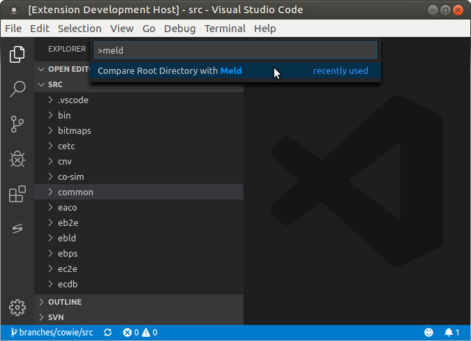
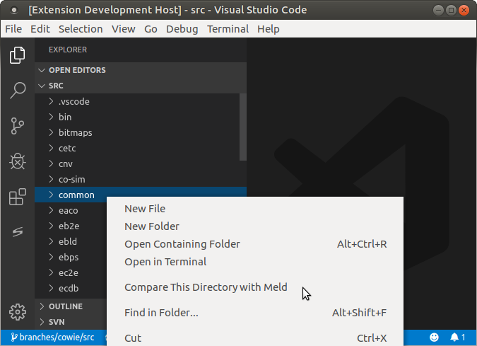
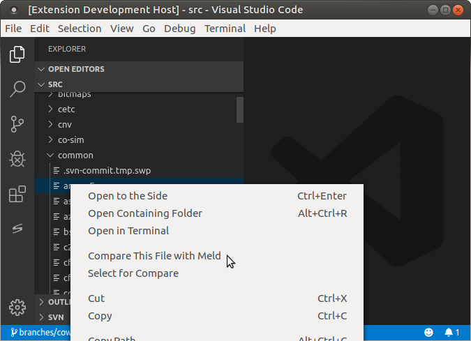

# Meld Launcher for VScode README

This package allows Meld to be launched from inside VScode.
Meld is a free and open source visual diff and merge program that, crutially, allows recursive diffing of directory trees.
See [their website](https://meldmerge.org) for more details.

## Features

Three functions are currently available:

1. Compare Root Directory with Meld: accessed from the command palette

2. Compare This Directory with Meld: available as an option when right-clicking a directory in the explorer

3. Compare This File with Meld: available as an option when right-clicking a file in the explorer

All three of these functions will open up a file browser, prompting the user to select a directory or file to compare against. 
Once a selection is made, Meld should open in a separate window.

> When Meld opens, the item selected in the file browser will be on the left, and the selection within VScode will be on the right.

## Requirements

Clearly, this package requires Meld.

* Linux: `apt install meld`
* Windows: [download from website](https://meldmerge.org/)

## Extension Settings

Currently no settings are available; if you can think of any that would be useful please let me know.

## Known Issues

The Meld executable must be available on your environment path.

Doesn't seem to be able to invoke Meld correctly when VScode is invoked from WSL.

Also note that in this initial release, error handling is basically non existent.
This will improve in future versions if there is interest in the package.

## Disclaimer

I am not a developer of Meld, nor am I affiliated with the developers in any way.
This package is just a productivity aid I wrote for myself, because recursive diffing (without git) is pretty much the only thing VScode doesn't do (and I like Meld).

## Release Notes

### 0.0.1

Initial release.
